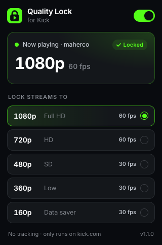
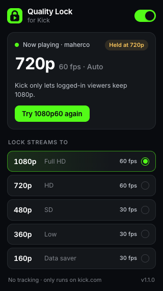
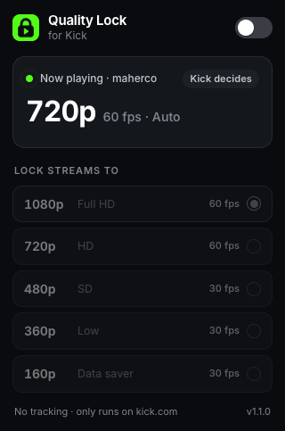

# Quality Lock for Kick

Kick.com plays streams on Auto, and Auto never goes above 720p. Every time you open another channel, Kick resets the quality again. Quality Lock keeps every stream at the quality you pick, and switches the moment you change it.

Works in Chrome (and other Chromium browsers) and in Zen and Firefox.

<p>
  
  
  
</p>

- **Every stream starts at your quality**, including when you move between channels inside Kick.
- **Switches instantly** from the popup. No reload.
- **Shows what's playing** on the current tab, and which qualities the stream offers.
- **Closest match** when a stream lacks your quality: lock to 1080p on a 720p stream and you get 720p60, not Kick's Auto.
- **One switch to turn it off** and hand control back to Kick.
- **No tracking.** Settings stay in your browser, and it only runs on kick.com.

## Install

Download the build for your browser from this repo's Releases, or build it yourself (see below).

### Chrome, Edge, Brave, Arc

1. Unzip `quality-lock-for-kick-chrome-<version>.zip`.
2. Open `chrome://extensions` and turn on **Developer mode**.
3. Click **Load unpacked** and pick the unzipped folder.
4. Pin the icon from the puzzle-piece menu.

### Zen, Firefox

1. Open `about:config` and set `xpinstall.signatures.required` to `false`. Zen allows this. Release Firefox doesn't, so use Firefox Developer Edition or Nightly, or sign the build (below).
2. Open `about:addons`, click the gear icon, choose **Install Add-on From File…** and pick `quality-lock-for-kick-firefox-<version>.xpi`.
3. When asked, allow it on kick.com ("Always allow on kick.com").

To skip the signature setting, sign the Firefox build as an unlisted add-on with your own [AMO API keys](https://addons.mozilla.org/developers/addon/api/key/):

```sh
npx web-ext sign --source-dir dist/firefox --channel unlisted --api-key "$AMO_JWT_ISSUER" --api-secret "$AMO_JWT_SECRET"
```

## Limits

- **1080p needs a Kick login.** Kick only lets logged-in viewers keep 1080p. Logged-out viewers get a short HD trial, then Kick lowers the quality itself. Quality Lock doesn't work around that; the popup tells you when it happens.
- This relies on how Kick's player works today (checked October 2026). If Kick changes it, the lock may stop working until it's updated. It won't break the page.

## How it works

Two content scripts run on kick.com:

- `src/bridge.js` runs in the extension's isolated world. It copies your choice into the tab's `sessionStorage` and relays popup requests.
- `src/page.js` runs in the page's own world, before Kick's scripts, and works in two layers.

**Layer 1, storage.** Kick's player reads `sessionStorage.stream_quality` (a height such as `1080`) when a stream becomes ready. It also wipes any stored value of 1080 or more on every new stream. `page.js` turns that wipe into a write of your choice. This alone makes page loads and channel switches start at the right quality.

**Layer 2, player store.** Kick keeps its player in a zustand store whose state has an `ivsLivestreamPlayer` field. Zustand builds each new state with `Object.assign({}, state, patch)`, so a setter on `Object.prototype` sees every new state object. Holding the latest one lets `page.js` call Kick's own `setQuality` action. That gives instant switching, the closest-match fallback, and the live status in the popup. Because it goes through Kick's own action, Kick's menu stays in sync and Kick's own rules still apply. If Kick changes this, layer 1 keeps working and the popup offers a reload instead.

Inspired by [greatsworn/Kick-Quality-Enforcer](https://github.com/greatsworn/Kick-Quality-Enforcer), which opens Kick's settings menu and clicks the option instead.

## Develop

```sh
npm install
npm run build     # dist/chrome, dist/firefox and their .zip / .xpi
npm run lint      # web-ext lint on the Firefox build
npm run icons     # re-render src/icons/*.png from src/icons/icon.svg (uses Chrome)
npm start         # Zen with the extension loaded in a temporary profile
```

`scripts/build.mjs` writes each browser's manifest. Everything else is shared from `src/`.

### End-to-end check

`test/e2e.mjs` drives a real browser against live kick.com. It finds two live channels that offer 1080p. It plays the first one without the extension, then with it. It switches to 480p and back while the stream plays, then moves to the second channel through Kick's in-app navigation. In Chrome it does the switching through the real popup and saves a screenshot of each popup state to `dist/screenshots/`.

```sh
npm run e2e                               # Zen
npm run e2e -- --browser=chrome           # Chrome, including the popup
npm run e2e:login                         # once: log in to Kick in a test profile (-- --browser=chrome for Chrome)
npm run e2e -- --logged-in                # same checks while logged in (add --browser=chrome for Chrome)
```

Logged out, Kick's own 1080p rule makes the 1080p-after-load check unreliable, so the test reports it as `SKIP`. Set `BROWSER_BIN` to use another browser binary and `HEADED=1` to watch it run.

Inter is bundled for the popup under the SIL Open Font License (`src/popup/fonts/LICENSE-Inter.txt`).
